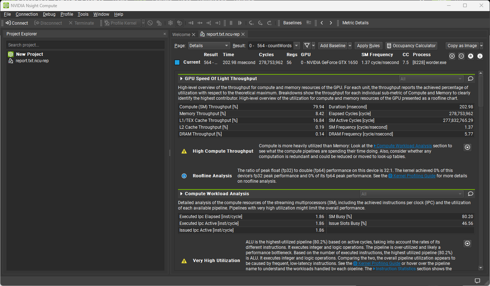
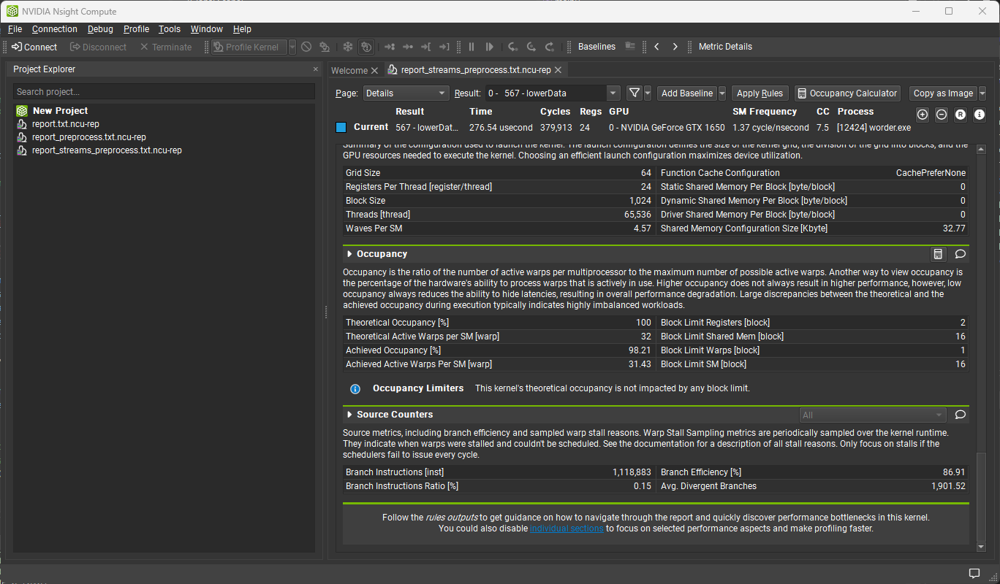

# worder

This project is an attempt to implement a GPU-augmented word frequency analyser using the CUDA 
programming language. As depicted in the following sections, compared to CPU, GPU has 
had significant performance and speedup.

## Input

- ### Keywords
We used 10K most used English words from Google to use as our subject histogram and keywords.
The number and offset of keywords to read from the dataset file is arbitrary but subject to the upperbound of **1489**.

- ### Data
We gathered text datasets of varying sizes from 5MB to 59MB for testing purposes. The dataset consists of texts from articles and books. Proportional to the size of the dataset, the application loads a specific number of words into memory.

| Data   | Number of Words to Read | Size (MB) |
|:------:|:-----------------------:|:---------:|
| Small | 131072 | 4 |
| Medium | 393216 | 12 |
| Large | 786432  | 24 |
| Huge | 1572864 | 48 |

## Implementation

The application reads the file of keywords and creates a list of them in memory. Likewise, the data file to process gets withdrawn. The application reserves 32-byte chunks of memroy for each word. Thus, words are tokenised by default.

- ### Plain

This version of implementation, performs no preprocessing steps and directly processes data using CPU and GPU. This version achieves the best compute throughput.

| Data   | CPU Time (ms) | GPU Time (ms) |
|:------:|:-------------:|:-------------:|
| Small | 185 | 19.7651 |
| Medium | 579 | 54.6565 |
| Large | 1072 | 107.103 |
| Huge | 2017 | 208.281 |

As can be seen, we achieved an average speedup of approximately 10.

- ### Preprocess

This version of implementation, performs some preprocessing steps including lowercasing and punctuation removal before processing data using CPU and GPU.

| Data   | CPU Time (ms) | GPU Time (ms) |
|:------:|:-------------:|:-------------:|
| Small | 190 | 20.7706 |
| Medium | 613 | 57.7872 |
| Large | 1126 | 112.563 |
| Huge | 2106 | 218.822 |

As result data indicates, we achieved an average speedup of nearly 10 yet again.

- ### Streams

This version of implementation, makes use of CUDA streams to pipeline data transfer and processing. By breaking the input data (data decomposition), each data section independently of others, gets preprocessed and processed by GPU.

| Data   | GPU Time (ms) |
|:------:|:-------------:|
| Small | 31.8311 |
| Medium | 69.9853 |
| Large | 127.618 |
| Huge | 236.412 |

This time, to our surprise, we achieved a lower speedup compared to the previous steps, an average of nearly 8. The reason behind this slow-down is the occupancy of the kernels. The written kernel achieves an occupancy of about 98%. Thus, the different streams, although called in parallel, run in serial. With the overhead of many streams and kernel creations and launches, the computation times just deteriorate.

## Optimisation Strategies

The main optimisation steps include:
1. **Use of shared memory for the keywords array**; using shared memory considerably 
speeds up search among the keywords to find the right histogram index to update. 
When each block maintains its own keywords inside shared memory, the access 
time to keywords reduces by several orders of magnitude compared to when 
reading keywords from the global memory.
2. **Coalescing accesses to the global memory**; as much as possible, the application is 
written in a way that threads access consecutive memory addresses. This way 
threads accesses coalesce into one memory access for multiple threads and the 
read/write time to and from memory decreases.
3. **Use of local histogram to reduce conflicts**; using local histograms limits the race 
conditions on histogram updates to block level during the main execution loads 
and increases performance.